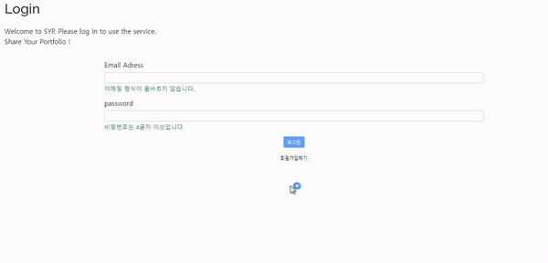
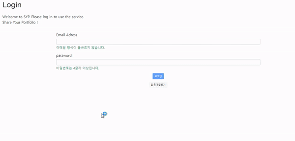
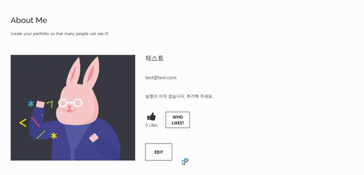
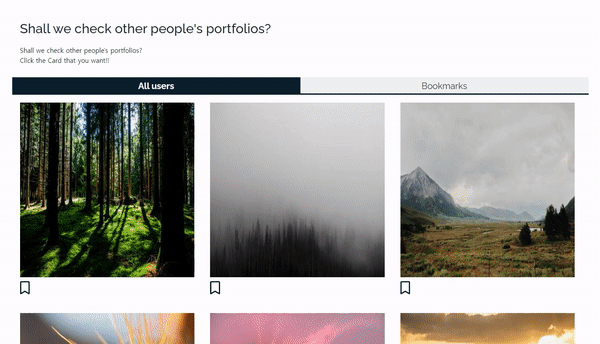
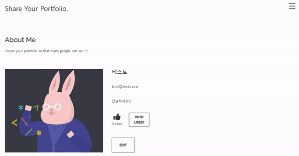

# 💻 당신의 포트폴리오를 공유해보세요


<br />

## 📃 개요

- 서비스명 : SYP (Share Your Portfolio)
- 개발 기간 : 2022.08.22 ~ 2022.09.02
- 주제 : 포트폴리오 공유를 위한 웹사이트 개발 프로젝트
- 목표 : 사용자들 간의 편리한 포트폴리오 공유
- api 문서 : [바로 가기](https://ihateai.github.io/Team10_apidoc/)
- 테스트 페이지 : [바로 가기](http://kdt-ai5-team10.elicecoding.com/)

<br />

## 👪 팀원 소개


**김대운**
- Front-End
- Gmail : eodnsdlekd@gmail.com
- Github : [@dlzagu](https://github.com/dlzagu)

**김준호**
- Front-End
- Gmail : foxmon1524@gmail.com
- Github : [@foxmon](https://github.com/foxmon)

**오다현**
- Front-End
- Gmail : peelsob4d@gmail.com
- Github : [@Peelsob4d](https://github.com/Peelsob4d)

**윤태경**
- Front-End
- Gmail : origin1508@gmail.com
- Github : [@origin1508](https://github.com/origin1508)

**황현성**
- Back-End
- Gmail : hhs950120@gmail.com
- Github : [@iHateAI](https://github.com/iHateAI)

<br />

## 🔧 기술 스택

### Front-End

<div>


</div>

<br />

### Back-End

<div>


</div>

<br />

### Server-Infra
<div>


</div>

<br />

## 📁 프로젝트 구조

### Front-End

```
📦src
 ┣ 📂components
 ┃ ┣ 📂award
 ┃ ┃ ┣ 📜AwardCard.js
 ┃ ┃ ┣ 📜AwardCardAddForm.js
 ┃ ┃ ┣ 📜AwardCardEdit.js
 ┃ ┃ ┣ 📜AwardCardPresenter.js
 ┃ ┃ ┗ 📜AwardContainer.js
 ┃ ┣ 📂bookmark
 ┃ ┃ ┣ 📜BookmarkButton.js
 ┃ ┃ ┗ 📜BookmarksList.js
 ┃ ┣ 📂certificate
 ┃ ┃ ┣ 📜Certificate.js
 ┃ ┃ ┣ 📜CertificateAddForm.js
 ┃ ┃ ┣ 📜CertificateCard.js
 ┃ ┃ ┣ 📜CertificateContainer.js
 ┃ ┃ ┗ 📜CertificateEditForm.js
 ┃ ┣ 📂education
 ┃ ┃ ┣ 📜Education.js
 ┃ ┃ ┣ 📜EducationAddForm.js
 ┃ ┃ ┣ 📜EducationCard.js
 ┃ ┃ ┣ 📜EducationContainer.js
 ┃ ┃ ┣ 📜EducationDelete.js
 ┃ ┃ ┗ 📜EducationEditForm.js
 ┃ ┣ 📂icon
 ┃ ┃ ┗ 📜Icon.js
 ┃ ┣ 📂modal
 ┃ ┃ ┣ 📜AlertModal.js
 ┃ ┃ ┣ 📜ConfirmModal.js
 ┃ ┃ ┗ 📜UserModal.js
 ┃ ┣ 📂project
 ┃ ┃ ┣ 📂dev
 ┃ ┃ ┃ ┗ 📜mockApiProject.js
 ┃ ┃ ┣ 📜Project.js
 ┃ ┃ ┣ 📜ProjectAddForm.js
 ┃ ┃ ┣ 📜ProjectCard.js
 ┃ ┃ ┣ 📜ProjectEditForm.js
 ┃ ┃ ┗ 📜Projects.js
 ┃ ┣ 📂style
 ┃ ┃ ┣ 📜app.css
 ┃ ┃ ┗ 📜app.scss
 ┃ ┣ 📂user
 ┃ ┃ ┣ 📜LoginForm.js
 ┃ ┃ ┣ 📜Network.js
 ┃ ┃ ┣ 📜RegisterForm.js
 ┃ ┃ ┣ 📜User.js
 ┃ ┃ ┣ 📜UserCard.js
 ┃ ┃ ┣ 📜UserCard2.js
 ┃ ┃ ┣ 📜UserEditForm.js
 ┃ ┃ ┣ 📜UserImageProfile.js
 ┃ ┃ ┣ 📜UserLike.js
 ┃ ┃ ┣ 📜UserLikeList.js
 ┃ ┃ ┣ 📜Users.js
 ┃ ┃ ┗ 📜UsersBookmarked.js
 ┃ ┣ 📜Header.js
 ┃ ┗ 📜Portfolio.js
 ┣ 📂dev
 ┃ ┣ 📜testApi.js
 ┃ ┣ 📜testData.js
 ┃ ┣ 📜useAwardValidation.js
 ┃ ┣ 📜useCertificateValidation.js
 ┃ ┣ 📜useEducationValidation.js
 ┃ ┣ 📜useUserValidation.js
 ┃ ┣ 📜useValidation.js
 ┃ ┗ 📜validation.js
 ┣ 📂hooks
 ┃ ┣ 📜useForm.js
 ┃ ┗ 📜useModal.js
 ┣ 📂rule
 ┃ ┗ 📜RULE.md
 ┣ 📂util
 ┃ ┣ 📂theme
 ┃ ┃ ┗ 📜theme.js
 ┃ ┣ 📂validation
 ┃ ┃ ┗ 📜validation.js
 ┃ ┗ 📜errorUtil.js
 ┣ 📜api.js
 ┣ 📜App.js
 ┣ 📜index.js
 ┗ 📜reducer.js
```

### Back-End

```
📦src
 ┣ 📂db
 ┃ ┣ 📂models
 ┃ ┃ ┣ 📜Award.js
 ┃ ┃ ┣ 📜Certification.js
 ┃ ┃ ┣ 📜Education.js
 ┃ ┃ ┣ 📜Like.js
 ┃ ┃ ┣ 📜Project.js
 ┃ ┃ ┗ 📜User.js
 ┃ ┣ 📂schemas
 ┃ ┃ ┣ 📜award.js
 ┃ ┃ ┣ 📜certification.js
 ┃ ┃ ┣ 📜education.js
 ┃ ┃ ┣ 📜like.js
 ┃ ┃ ┣ 📜project.js
 ┃ ┃ ┗ 📜user.js
 ┃ ┗ 📜index.js
 ┣ 📂middlewares
 ┃ ┣ 📜errorMiddleware.js
 ┃ ┗ 📜login_required.js
 ┣ 📂routers
 ┃ ┣ 📜awardRouter.js
 ┃ ┣ 📜certificationRouter.js
 ┃ ┣ 📜educationRouter.js
 ┃ ┣ 📜projectRouter.js
 ┃ ┗ 📜userRouter.js
 ┣ 📂services
 ┃ ┣ 📜awardService.js
 ┃ ┣ 📜certificationService.js
 ┃ ┣ 📜educationService.js
 ┃ ┣ 📜projectService.js
 ┃ ┗ 📜userService.js
 ┣ 📂uploads
 ┣ 📂utils
 ┃ ┣ 📜dateObjToString.js
 ┃ ┗ 📜multer.js
 ┗ 📜app.js
```

<br />

## 🔍 주요 기능

### 🌈 회원가입
- 포트폴리오 공유를 위한 계정을 생성할 수 있어요!
- 이메일, 비밀번호, 이름을 입력 받아요.
<details>
<summary>자세히 보기</summary>


</details>

---

### 💎 로그인
- 포트폴리오 공유를 위한 로그인을 할 수 있어요!
<details>
<summary>자세히 보기</summary>


</details>

---

### 💍 유저 정보 편집
- 유저 정보를 수정할 수 있어요!
- 이메일, 이름, 비밀번호, 소개란을 변경할 수 있어요.
<details>
<summary>자세히 보기</summary>


</details>

---

### 🔑 포트폴리오 정보 추가
- 포트폴리오 정보를 추가, 수정, 삭제 할 수 있어요!
- Education, Award, Certificate, Project 모두 같은 방식으로 작동해요.
<details>
<summary>자세히 보기</summary>


</details>

---

### ⛅ 네트워크 페이지
- 네트워크 페이지에서 다른 사용자를 찾을 수 있어요!
- 무한 스크롤링 기능으로 등록된 모든 사용자를 찾아 볼 수 있어요.
<details>
<summary>자세히 보기</summary>


</details>

---

### ✨ 다른 유저 포트폴리오 보기
- 다른 유저가 만든 포트폴리오를 확인할 수 있어요!
- 네트워크 페이지에서 원하는 유저 카드를 클릭하세요.
<details>
<summary>자세히 보기</summary>


</details>

---

### 📌 프로필 이미지 변경
- 자신이 원하는 이미지로 프로필 이미지를 변경할 수 있어요!
<details>
<summary>자세히 보기</summary>


</details>

---

### ⭐ 북마크
- 다른 사용자의 포트폴리오 페이지를 북마크 할 수 있어요!
- 북마크 페이지에서 북마크로 지정했던 유저 카드를 모아 볼 수 있어요.
<details>
<summary>자세히 보기</summary>


</details>

---

### 👍 좋아요
- 감명 깊게 봤던 포트폴리오의 주인에게 좋아요를 남길 수 있어요!
<details>
<summary>자세히 보기</summary>


</details>

---

<br />

## 🔍 테스트 방법

1. 해당 프로젝트를 clone 합니다.
```
git clone https://kdt-gitlab.elice.io/ai_track/class05/web_project/team10.git
```

2. 프로젝트 실행에 필요한 패키지를 설치합니다.
```
-- npm 사용 시 --

cd front
npm install

cd back
npm install
```
```
-- yarn 사용 시 --

cd front
yarn

cd back
yarn
```

3. 몽고디비 설치 후 연결합니다.
```
-- 몽고디비 아틀라스 사용 시 --

1. 몽고디비 아틀라스 클라우드 데이터베이스 생성
2. back 디렉토리의 .env 파일 편집
3. MONGODB_URL 변수에 DB URL을 삽입
4. ex) MONGODB_URL="mongodb+srv://<DB명>:<비밀번호>@<db명>.m5knbpd.mongodb.net/?retryWrites=true&w=majority"
```

```
-- 로컬에서 몽고디비 사용 시 --

1. 몽고디비 설치
2. back 디렉토리의 .env 파일 편집
3. MONGODB_URL 변수에 mongodb://localhost:27017/ 삽입
```

4. 프론트엔드 서버와 백엔드 서버를 실행합니다.
```
-- npm 사용 시 --

cd front
npm start

cd back
npm start
```

```
-- yarn 사용 시 --

cd front
yarn start

cd back
yarn start
```
5. 마음껏 테스트 해보세요!